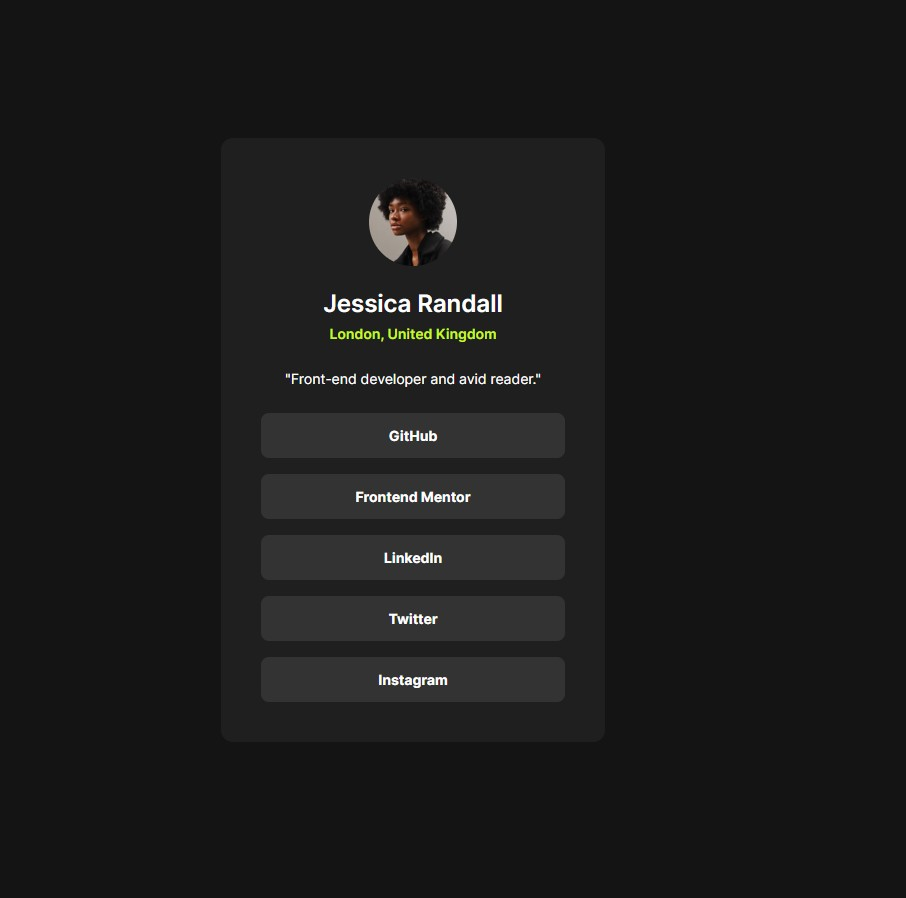

# Frontend Mentor - Social links profile solution

This is a solution to the [Social links profile challenge on Frontend Mentor](https://www.frontendmentor.io/challenges/social-links-profile-UG32l9m6dQ). Frontend Mentor challenges help you improve your coding skills by building realistic projects.

## Table of contents

* [Overview](#overview)

  * [The challenge](#the-challenge)
  * [Screenshot](#screenshot)
  * [Links](#links)
* [My process](#my-process)

  * [Built with](#built-with)
  * [What I learned](#what-i-learned)
  * [Continued development](#continued-development)
  * [Useful resources](#useful-resources)
  * [AI Collaboration](#ai-collaboration)
* [Author](#author)

## Overview

### The challenge

Users should be able to:

* View the optimal layout depending on their device's screen size
* See hover and focus states for all interactive elements on the page

### Screenshot



### Links

* Solution URL: [Add solution URL here](https://github.com/shigureyn/social-links-profile)
* Live Site URL: [Add live site URL here](https://shigureyn.github.io/social-links-profile/)

## My process

### Built with

* Semantic HTML5 markup
* CSS custom properties
* Flexbox
* Mobile-first workflow
* Local `@font-face` font loading
* BEM-style class naming

### What I learned

While working on this project, I practiced building a small profile card component with semantic HTML and clean CSS structure.

I learned how to structure a list of social links using `ul`, `li`, and `a` elements instead of using only `div` elements:

```html
<ul class="profile-card__links" aria-label="Social links">
  <li class="profile-card__item">
    <a href="#" class="profile-card__link">GitHub</a>
  </li>
</ul>
```

I also practiced loading a local variable font with `@font-face`:

```css
@font-face {
  font-family: "Inter";
  src: url("../fonts/Inter-VariableFont_slnt,wght.ttf") format("truetype");
  font-weight: 100 900;
  font-style: normal;
  font-display: swap;
}
```

Another important part was centering the card on the page with Flexbox:

```css
.main {
  flex: 1;
  display: flex;
  justify-content: center;
  align-items: center;
  padding: 1.5rem;
}
```

### Continued development

In future projects, I want to continue improving:

* Responsive layouts
* Accessible interactive elements
* Better CSS organization
* Working with semantic HTML
* Creating clean and reusable components

### Useful resources

* [MDN Web Docs - HTML](https://developer.mozilla.org/en-US/docs/Web/HTML) - Helped me understand semantic HTML elements.
* [MDN Web Docs - CSS](https://developer.mozilla.org/en-US/docs/Web/CSS) - Helped me check CSS properties and best practices.
* [Frontend Mentor](https://www.frontendmentor.io/) - Provided the challenge design and requirements.

### AI Collaboration

I used ChatGPT during this project as a learning assistant.

AI helped me with:

* Reviewing the HTML structure
* Improving semantic markup
* Choosing better class names
* Understanding accessibility details like `aria-label` and `focus-visible`
* Building the CSS step by step
* Checking the final code before finishing the project

I wrote and adjusted the final code myself while using AI explanations to understand each part of the solution.

## Author

* GitHub - [@shigureyn](https://github.com/shigureyn)
* Frontend Mentor - [@shigureyn](https://www.frontendmentor.io/profile/shigureyn)
